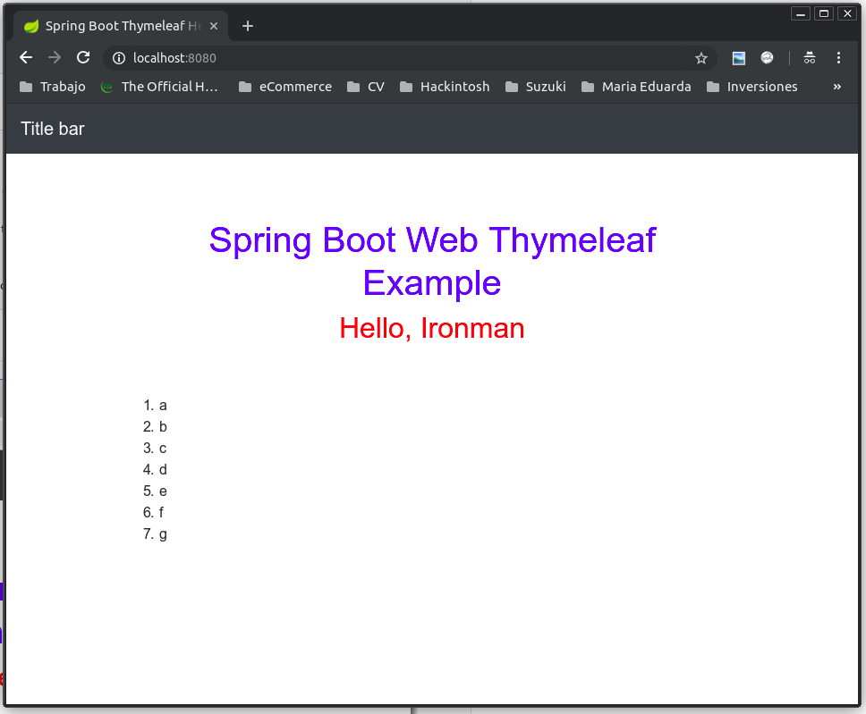
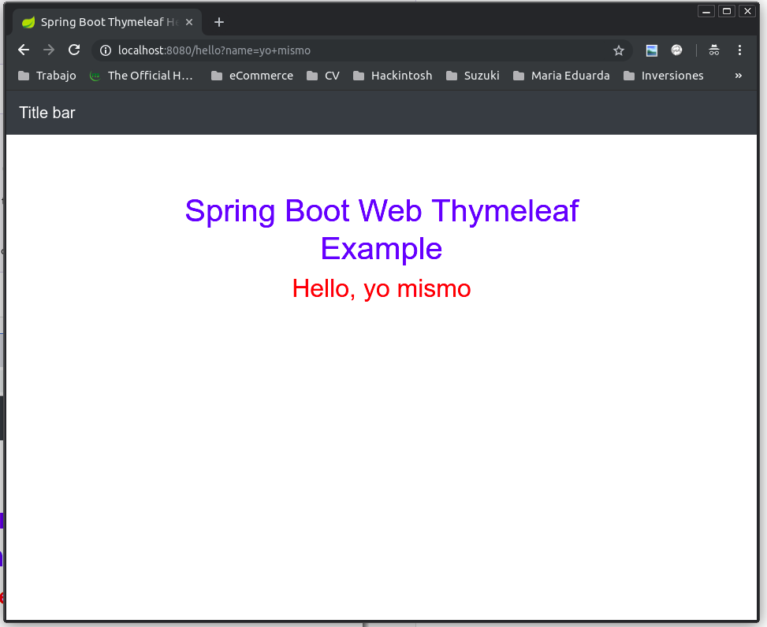

# Demo Thymeleaf

Primero compilar y ejecutar:

`./mvnw spring-boot:run`

Luego accede desde el navegador a [http://localhost:8080](). Se debe mostrar una interfaz como la que sigue:

Además agregué un controlador adicional para que veas como se usa donde imprime el nombre que le pases por parametros `GET`, lo puedes consultar en esta direccion [http://localhost:8080/hello?name=mi+mismo]() y se debe mostrar lo siguiente: 

Ahora a partir de aqui busca que tienes mal. Un ejemplito de clase de primaria. Toda la magia esta en la clase [WelcomeController.java](src/main/java/com/example/demo/ctrl/WelcomeController.java). 

Tambien te incluí un test unitario para que aprendas ya a trabajar como un profesional y validar las cosas desde el desarrollo. Eso lo puedes ver aqui en la clase [WelcomeControllerTest.java](src/test/java/com/example/demo/ctrl/WelcomeControllerTest.java)